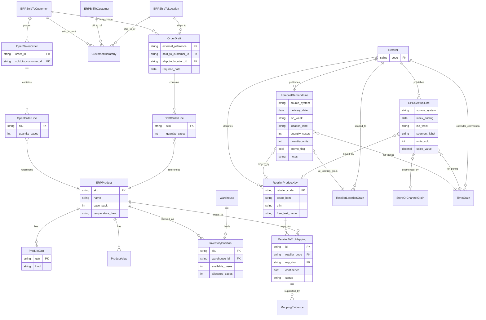
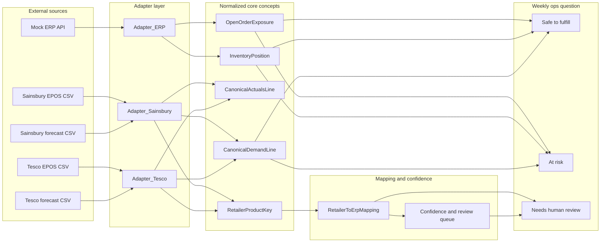
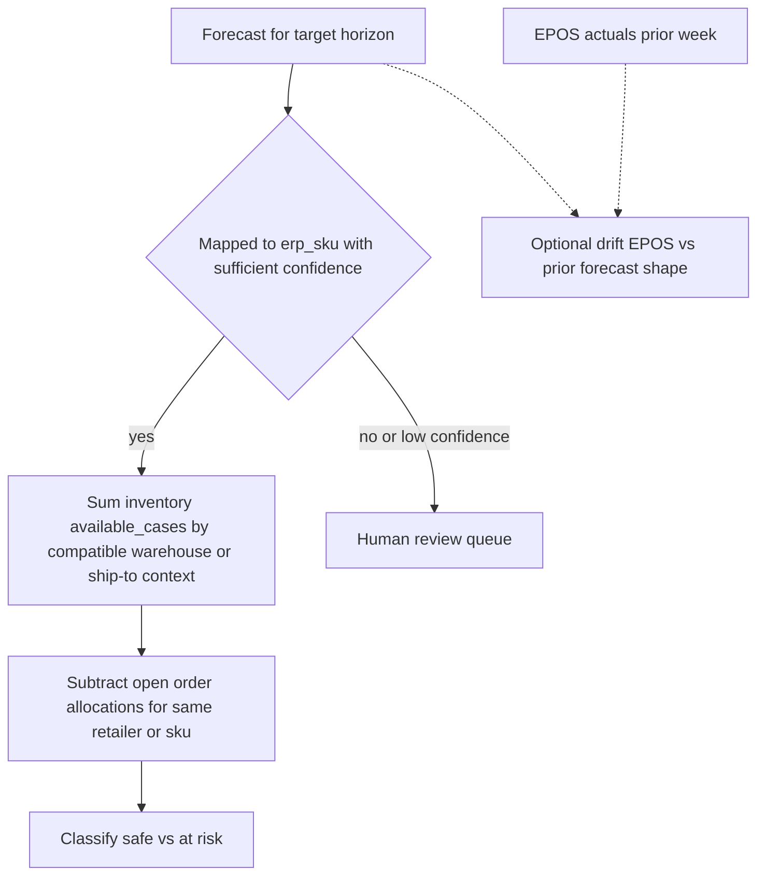

# Verdano Foods problem space — entity model (first pass)

This is derived from [README.md](../../README.md), [ERP API.md](../../ERP API.md), and the four mock CSVs (Tesco/Sainsbury forecast week 20, EPOS week 19).

## Core tension (what the diagram encodes)

- **Canonical truth** lives in the ERP: products (by internal `sku`), customers (`sold_to` / `bill_to` / `ship_to`), warehouses, inventory (cases by `sku` + `warehouse_id`), committed open orders, and optional order drafts.
- **Retailer reality** arrives as **different shapes**: Tesco uses `tesco_item` + `depot` + **cases** + **calendar delivery dates**; Sainsbury's uses `gtin` (sometimes blank) + `item_name` + **ISO receipt week** + **consumer units** + `temperature_band` + aggregated `geography` ("All Depots").
- **The missing subsystem** (your MCP/tools sit here): **adapters** normalize rows into shared concepts; **mappings** link retailer identifiers to ERP `sku` with **confidence** and **human-review** when ambiguous (README explicitly calls out ambiguous mappings and provenance).

## Entity-relationship diagram (conceptual)

Mermaid `erDiagram` uses conceptual names; attribute lists mix ERP field names and retailer column names where they matter for integration.

**Grokking notes embedded in the diagram**

- **`RetailerProductKey`** is a deliberate composite abstraction: for Tesco the natural key skews toward `tesco_item`; for Sainsbury's it skews toward `gtin` + `item_name` with **nullable GTIN** in the mock data (ambiguous identity).
- **`TimeGrain`** is not one table in any source — Tesco forecasts use **delivery dates**; Sainsbury's uses **ISO weeks** (`receipt_week`); EPOS files use **week ending** (Tesco) vs **week** (Sainsbury's). Any “compare next week” logic spans this boundary.
- **`RetailerLocationGrain`**: Tesco `depot` (e.g. Daventry Chilled) vs Sainsbury's `geography` ("All Depots") vs ERP `ship_to` / `warehouse_id` — fulfillment and temperature rules ([order-drafts validation in ERP API](../../ERP API.md)) tie **ship-to** and **warehouse temperature** to **product temperature_band**.
- **Units**: Tesco forecast is **cases**; Sainsbury's forecast is **units**; Tesco EPOS is **eaches**; Sainsbury's EPOS is **units** — normalization to a single demand/supply unit (typically ERP **cases** via `case_pack`) is a cross-cutting derivation, not a raw column.

## Problem-space map: sources → normalized facts → decisions

## Lightweight “compare next week” join path (mental model)

## Entities you may want as interfaces (README evaluation criteria)

Polymorphism lines up naturally on **`RetailerAdapter` → `NormalizedRow`**, **`RetailerProductKey` refinements** (Tesco key vs Sainsbury key), and **`DemandQuantity`** (cases vs units with `case_pack` resolution from [`GET /erp/products`](../../ERP API.md)).

---

No code changes are required for this deliverable; this file is a reference model for implementing the MCP server and documenting tradeoffs.
